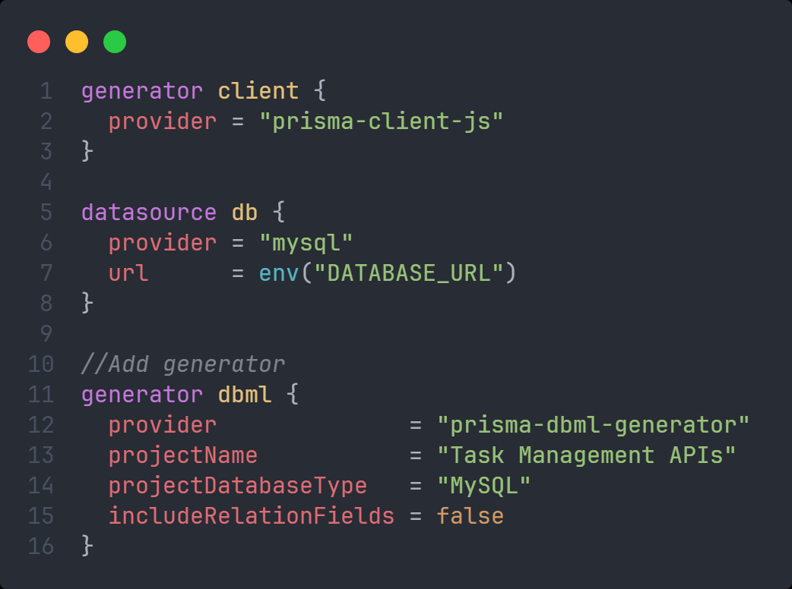

# Tạo ER Diagram từ Prisma Schema

- Bước 1: Cài đặt thư viện:

```bash
npm install -D prisma-dbml-generator
```

- Bước 2: Vào file **schema.prisma** và thêm:



:::note

- Trường **projectName** và **projectDatabaseType** hãy tự chỉnh sửa lại cho phù hợp với project của bạn

:::

- Bước 3: Chạy lệnh sau để generate DBML Code:

```bash
npx prisma generate
```

- Bước 4: Một file tên **prisma/dbml/schema.dbml** vừa mới được tạo ra, hãy copy toàn bộ nội dung trong file đó và truy cập trang web: https://dbdiagram.io/ và dán nó vào.
