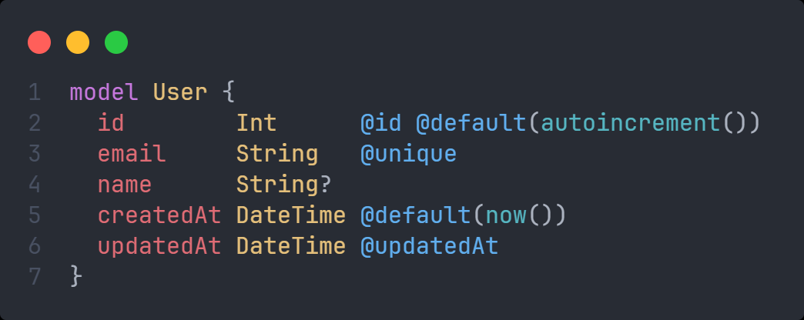
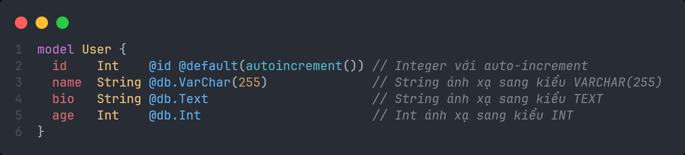
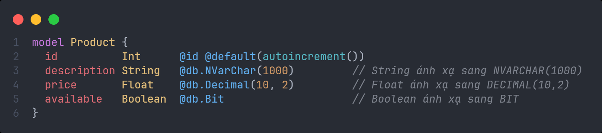
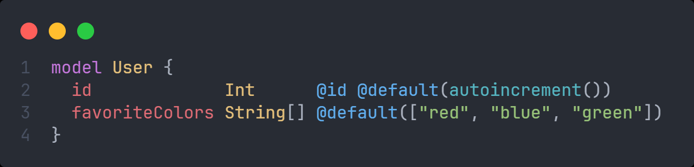
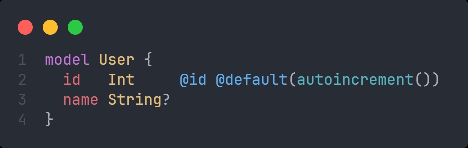
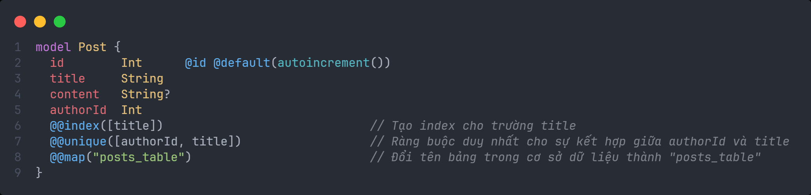
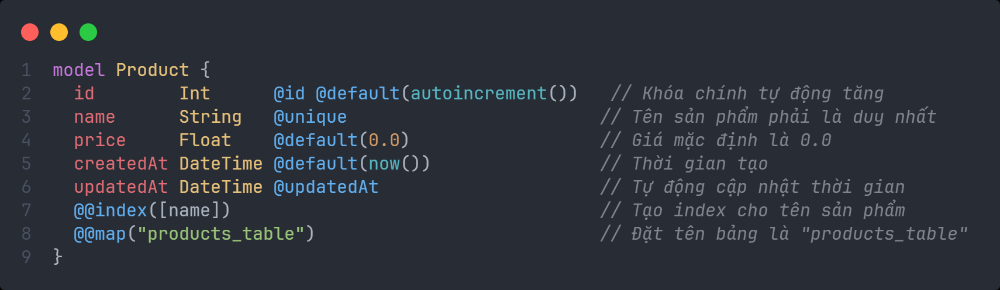
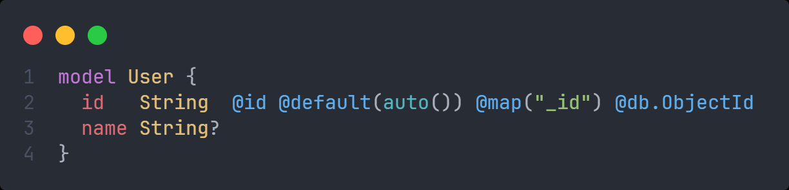
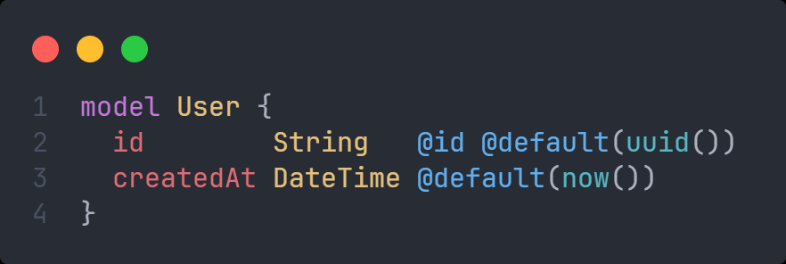

# Định nghĩa cột

- Một field trong 1 model được hình thành bởi cấu trúc sau:
  - **field_name**: tên cột
  - **field_type**: kiểu dữ liệu cho cột
  - **field_type_modifiers**: là các ký hiệu hoặc từ khóa được sử dụng để chỉ định thêm các thuộc tính hoặc sửa đổi đặc điểm của một trường (field) trong mô hình dữ liệu (model)
  - **attributes**: là các chú thích đặc biệt được sử dụng để xác định thêm thông tin hoặc ràng buộc cho các trường (fields) và mô hình (models) trong file `schema.prisma`. Attributes giúp định nghĩa các quy tắc đặc biệt liên quan đến cách dữ liệu được lưu trữ, truy xuất, và quan hệ giữa các bảng (mô hình) trong cơ sở dữ liệu. Các attributes thường được định nghĩa bằng cú pháp `@attribute_name`, và chúng có thể được áp dụng trên cả **trường** lẫn **mô hình** .
  - **attribute_function**: Thường nằm trong attribute để tự động tạo ra giá trị.
- Ví dụ:



- Trong ví dụ trên:
  - **field_name**: `id`, `email`, `name`,...
  - **field_type**: `Int`, `String`, `DateTime`
  - **field_type_modifiers**: `?` (ở cột name cho biết cột này có thể nhận giá trị `null`)
  - **attributes**: `@id` (chỉ định đây là khóa chính của entity), `@default`, `@updatedAt`,...
  - **attribute_function**: `autoincrement()` (chỉ định khóa chính có giá trị tăng dần khi thêm dữ liệu)

## Field name

- Quy tắc đặt tên:
  - Bắt đầu bằng chữ cái
  - Chỉ chứa các kí tự chữ cái, chữ số, dấu gạch dưới
  - Tuân theo quy tắc đặt tên camelCase (ví dụ như userName, categoryName,...)

## Field type

- Sau đây là các loại kiểu dữ liệu mà Prisma hỗ trợ:
  - `String`
  - `Boolean`
  - `Int`
  - `BigInt`
  - `Float`
  - `Decimal`
  - `DateTime`
  - `Json`
  - `Bytes`

### Default type mapping

- Khi ta sử dụng các kiểu dữ liệu của Prisma bên trên, với các CSDL, nó sẽ tương ứng như sau:

|          | MySQL            | PostgreSQL         | MongoDB           |
| -------- | ---------------- | ------------------ | ----------------- |
| String   | `varchar(191)`   | `text`             | `String`          |
| Boolean  | `TINYINT(1)`     | `boolean`          | `Bool`            |
| Int      | `INT`            | `integer`          | `Int`             |
| BigInt   | `BIGINT`         | `bigint`           | `Long`            |
| Float    | `DOUBLE`         | `double precision` | `Double`          |
| Decimal  | `DECIMAL(65,30)` | `decimal(65,30)`   | **Not Supported** |
| DateTime | `DATETIME(3)`    | `timestamp(3)`     | `Timestamp`       |
| Json     | `JSON`           | `jsonb`            | `BSON`            |

### Native type mapping

- **Native type mapping** trong Prisma là cơ chế cho phép ta ánh xạ (mapping) các kiểu dữ liệu của Prisma sang các kiểu dữ liệu cụ thể của cơ sở dữ liệu mà ta đang sử dụng. Điều này giúp ta tận dụng tối đa các kiểu dữ liệu đặc biệt hoặc tối ưu hơn của cơ sở dữ liệu mà Prisma không cung cấp trực tiếp.
- Mặc định, Prisma sử dụng một tập hợp các **kiểu dữ liệu chung** (generic types) như `String`, `Int`, `Boolean`, `DateTime`... Những kiểu này có thể được ánh xạ tự động sang kiểu dữ liệu phù hợp của cơ sở dữ liệu tương ứng. Tuy nhiên, nếu ta muốn có sự kiểm soát nhiều hơn hoặc tận dụng các kiểu dữ liệu cụ thể của từng hệ quản trị cơ sở dữ liệu (MySQL, PostgreSQL, SQL Server, MongoDB), ta có thể sử dụng tính năng **native types mapping**.
- Ta có thể sử dụng native types mapping bằng cách thêm **chú thích native type** ngay sau kiểu dữ liệu của trường trong mô hình Prisma. Chú thích này sử dụng cú pháp `@db.nativeType`, trong đó `nativeType` là tên của kiểu dữ liệu cụ thể của cơ sở dữ liệu ta muốn sử dụng.
- Cú pháp tổng quát:

```prisma
model ModelName {
  fieldName FieldType @db.nativeType
}
```

- Ví dụ, trong MySQL, ta có thể sử dụng native types như `VARCHAR`, `TEXT`, `DECIMAL`, v.v.



- PostgreSQL Native Type Mapping. PostgreSQL hỗ trợ các kiểu dữ liệu như `UUID`, `TEXT`, `BIGINT`, `TIMESTAMPTZ`, v.v.


- SQL Server Native Type Mapping. SQL Server có các kiểu như `NVARCHAR`, `DATETIME2`, `BIT`, v.v.



- Lợi ích của Native Type Mapping:

  - **Tối ưu hóa hiệu suất**: Việc sử dụng các kiểu dữ liệu native của cơ sở dữ liệu giúp tận dụng tối đa hiệu năng và tính năng mà cơ sở dữ liệu cung cấp.
  - **Kiểm soát chi tiết**: ta có thể kiểm soát chính xác kiểu dữ liệu và dung lượng của các trường, chẳng hạn như độ dài chuỗi, độ chính xác số học (precision), v.v.
  - **Tương thích với cấu trúc dữ liệu hiện có**: Nếu ta làm việc với một cơ sở dữ liệu hiện có với các kiểu dữ liệu cụ thể, ta có thể ánh xạ trực tiếp các trường sang kiểu native mà không cần thay đổi cấu trúc dữ liệu.

- Hạn chế:

  - **Khả năng tương thích**: Native type mapping làm cho Prisma schema của ta phụ thuộc vào loại cơ sở dữ liệu cụ thể. Nếu ta chuyển sang một hệ quản trị cơ sở dữ liệu khác, ta có thể cần phải thay đổi các kiểu native cho tương thích.

## Field type modifiers

- Có 2 loại modifiers:

  - `[]`: đánh dấu một field là một list
  - `?`: đánh dấu một field là optional

- Ví dụ về `[]` modifier:



- Ví dụ về `?` modifier:



## Attributes

- Trong Prisma, có **2 cách chính** để định nghĩa **attributes**:
  - **Field-level Attributes** (Thuộc tính cấp trường)
  - **Model-level Attributes** (Thuộc tính cấp mô hình)

### Field-level Attributes (Thuộc tính cấp trường)

- **Field-level attributes** được gán cho các trường (fields) trong một mô hình. Chúng xác định các ràng buộc, hành vi hoặc các tính năng đặc biệt cho trường đó. **Field-level attributes** thường được định nghĩa ngay sau loại trường (field type).
- Ví dụ:


- Các **field-level attributes** phổ biến:

| Field-level attributes | Mô tả                                                                |
| ---------------------- | -------------------------------------------------------------------- |
| `@id`                  | Định nghĩa khóa chính cho trường.                                    |
| `@unique`              | Tạo ràng buộc duy nhất cho trường.                                   |
| `@updatedAt`           | Tự động cập nhật giá trị mỗi khi bản ghi được thay đổi.              |
| `@default()`           | Đặt giá trị mặc định cho trường.                                     |
| `@map()`               | Đổi tên trường trong cơ sở dữ liệu mà không đổi tên trong mã Prisma. |
| `@relation()`          | Định nghĩa quan hệ giữa các mô hình.                                 |

### Model-level Attributes (Thuộc tính cấp mô hình)

- Model-level attributes được áp dụng cho toàn bộ mô hình và có thể tác động đến nhiều trường hoặc đến cách dữ liệu của mô hình đó được quản lý. Chúng thường được đặt dưới cùng của mô hình với cú pháp bắt đầu bằng `@@`.
- Ví dụ:



- Các **model-level attributes** phổ biến:

| Model-level attributes | Mô tả                                                                   |
| ---------------------- | ----------------------------------------------------------------------- |
| `@@index([])`          | Tạo index trên một hoặc nhiều trường để cải thiện hiệu suất truy vấn.   |
| `@@unique([])`         | Tạo ràng buộc duy nhất trên nhiều trường cùng lúc.                      |
| `@@map()`              | Đổi tên bảng trong cơ sở dữ liệu mà không đổi tên mô hình trong Prisma. |
| `@@id([])`             | Đặt khóa chính gồm nhiều trường (composite primary key).                |

Ví dụ tổng hợp cả hai loại attributes:



## Attribute function

- Trong Prisma, **attribute functions** là các hàm được sử dụng bên trong attributes để xác định các hành vi đặc biệt cho trường dữ liệu. Chúng được sử dụng chủ yếu để xác định các giá trị mặc định hoặc thao tác với các giá trị tự động.
- Dưới đây là các attribute function:

| Attribute function | Mô tả                                                            |
| ------------------ | ---------------------------------------------------------------- |
| `auto()`           | Giá trị mặc định được tạo bởi database. Chỉ hỗ trợ MongoDB.      |
| `autoincrement()`  | Tự động tạo giá trị number tăng dần (không hỗ trợ trong MongoDB) |
| `cuid()`           | Tự động tạo giá trị cuid                                         |
| `uuid()`           | Tự động tạo giá trị uuid                                         |
| `now()`            | Thiết lập giá trị timestemp khi một record (row) được tạo        |

- Ví dụ về `auto()`:



- Ví dụ về `uuid()`, `now()`:


