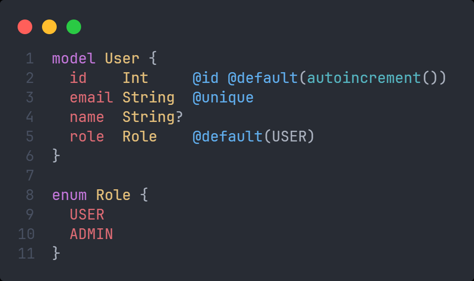
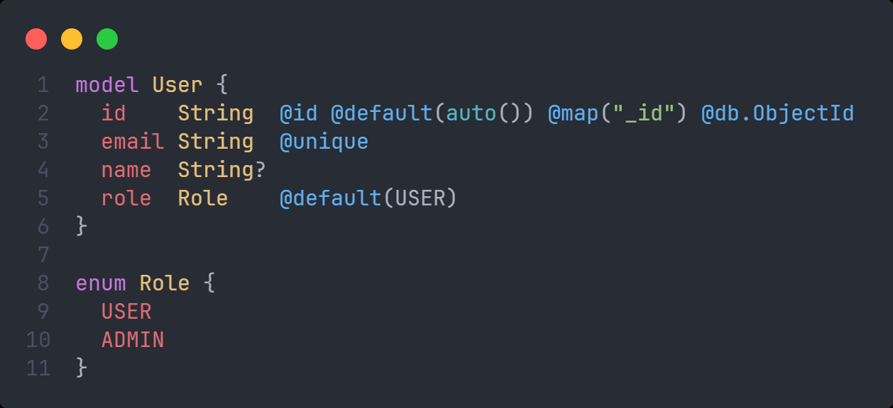
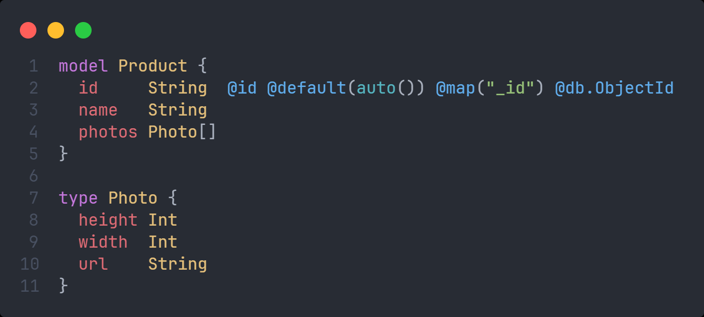

# enum và type

## enum

- Quy tắc đặt tên enum:
  - Chỉ chứa các kí tự chữ cái, chữ số, dấu gạch dưới (\_)
  - Tuân theo quy tắc đặt tên PascalCase
  - Tên enum phải ở dạng số ít (ví dụ như Role,...)

:::caution

- Enum không hỗ trợ trong CSDL **SQLite** và **Microsoft SQL Server**

:::

- Ví dụ trong relation databse:

- Ví dụ về MongoDB:

## type

:::caution

- Composite types chỉ hỗ trợ đối với **MongoDB**

:::

- Quy tắc đặt tên:

  - Bắt đầu bằng chữ cái và chỉ chứa các kí tự chữ cái, chữ số, dấu gạch dưới (\_)
  - Tuân theo quy tắc đặt tên PascalCase.

- Ví dụ:

