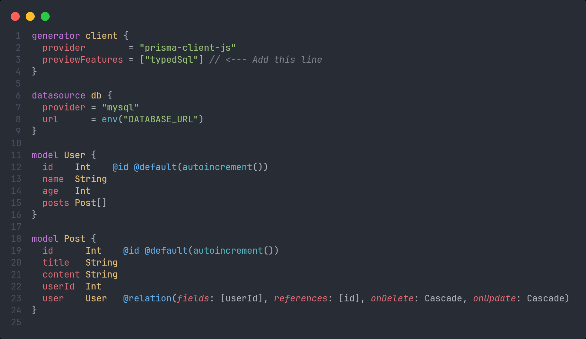

# Raw Query

## Cách sử dụng raw query trong Prisma

- Trong file prisma/schema.prisma, ta thêm `previewFeatures = ["typedSql"]`:



- Tạo thư mục **sql** bên trong thư mục **prisma** và thêm các file **.sql** vào đó để viết raw query, ví dụ:

```sql title="prisma/sql/getUsersByAge.sql"
SELECT
  *
FROM
  `user`
WHERE
  age > ?
  AND age < ?;
```

- Tiếp theo đó, ta chạy lệnh:

```bash
prisma generate --sql --watch
```

- Cuối cùng, ta có thể sử dụng hàm do Prisma tạo ra để thực hiện raw query:

```ts
import { PrismaClient } from "@prisma/client";
import { getUsersByAge } from "@prisma/client/sql";

const prisma = new PrismaClient();

async function main() {
  const data = await prisma.$queryRawTyped(getUsersByAge(18, 30));
  console.log(data);
}

main();
```

:::info

- Trong ví dụ trên, ta tạo file **getUsersByAge.sql** nhận vào 2 tham số là **minAge** và **maxAge** thông qua dấu `?`

:::
