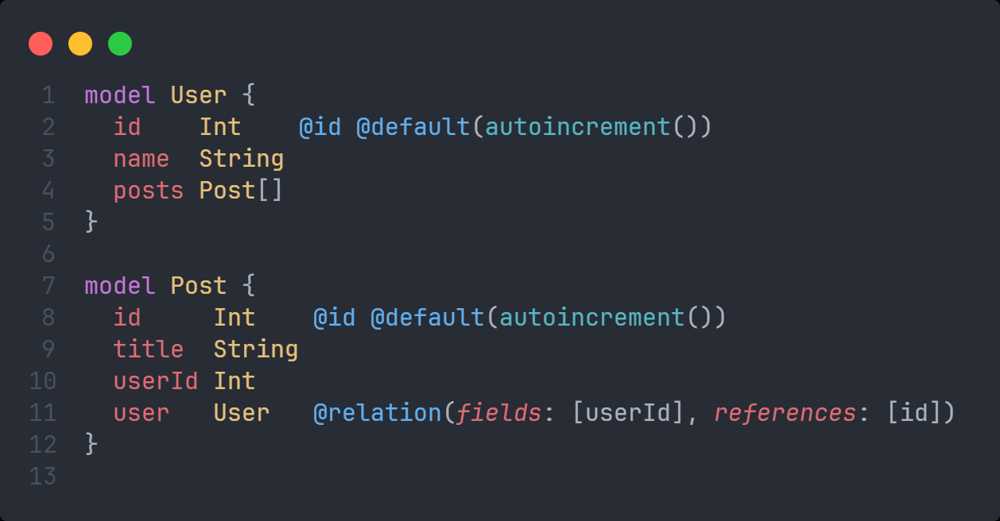
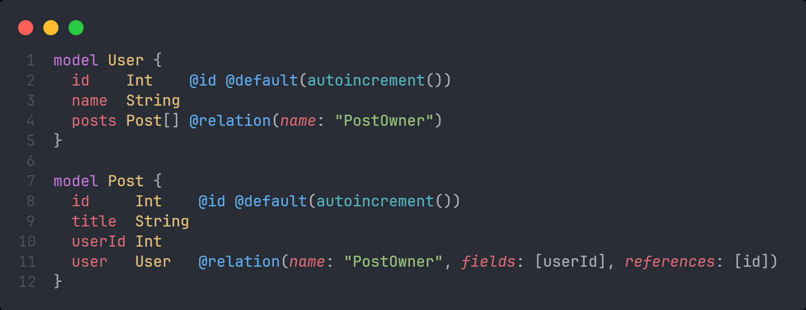
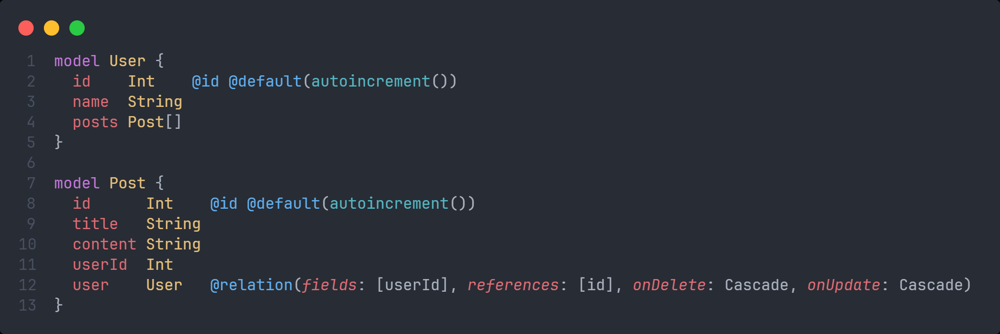

# `@relation()`

:::info

- Trong Prisma, decorator `@relation()` được sử dụng để định nghĩa mối quan hệ giữa hai mô hình (models) trong cơ sở dữ liệu. Các tham số của `@relation()` giúp xác định cách các bảng trong cơ sở dữ liệu liên kết với nhau.
- Dưới đây là các tham số quan trọng của `@relation()` và cách chúng hoạt động

:::

## fields

- Đây là một mảng các trường (fields) trong mô hình hiện tại, đóng vai trò là các khóa ngoại (foreign keys) kết nối với mô hình khác.
- Mỗi trường trong mảng này phải tương ứng với một cột trong bảng của mô hình, và nó sẽ lưu giá trị khóa ngoại của mô hình liên quan.

* Ví dụ:

- Ở đây, `userId` trong mô hình `Post` là trường khóa ngoại, được chỉ định trong `fields`.

## references

- Đây là mảng các trường trong mô hình được liên kết, đóng vai trò làm khóa chính (hoặc các trường duy nhất) mà khóa ngoại sẽ tham chiếu đến.
- Các trường trong `references` phải là các cột trong bảng của mô hình đích mà `fields` đang tham chiếu đến.
- Ở ví dụ trên, trường `id` của mô hình `User` được tham chiếu từ `Post` thông qua trường `userId`.

## name

- Đây là tên của mối quan hệ và giúp định danh mối quan hệ này khi có nhiều quan hệ cùng một kiểu giữa hai mô hình.
- Nếu không chỉ định, Prisma sẽ tự động tạo tên dựa trên các tên mô hình.
- Ví dụ:

## onDelete / onUpdate

- Tham số này định nghĩa hành động sẽ được thực hiện khi một bản ghi trong mô hình tham chiếu bị xóa hoặc được cập nhật
- Các giá trị có thể là:
  - `Cascade`: Khi bản ghi ở mô hình tham chiếu bị xóa, tất cả các bản ghi liên quan cũng sẽ bị xóa theo.
  - `SetNull`: Khi bản ghi ở mô hình tham chiếu bị xóa, khóa ngoại sẽ được đặt thành `null`.
  - `Restrict`: Ngăn không cho xóa bản ghi nếu có bản ghi khác tham chiếu đến nó.
  - `NoAction`: Không thực hiện hành động gì.
- Ví dụ:

➡️ Trong ví dụ trên:

- Khi một `User` bị xóa, tất cả các `Post` liên quan cũng sẽ tự động bị xóa.
- Khi `User` cập nhật `id`, tất cả các `Post` liên quan sẽ tự động cập nhật theo `userId` mới.
