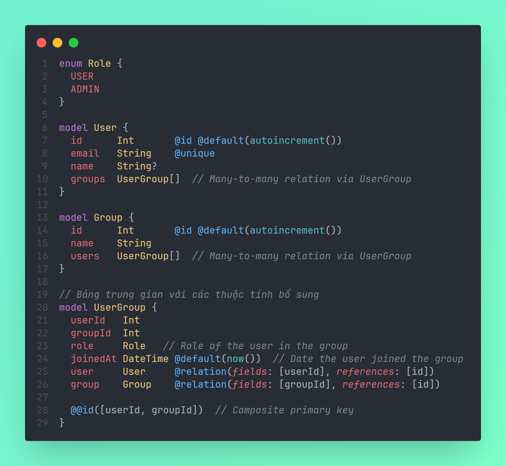
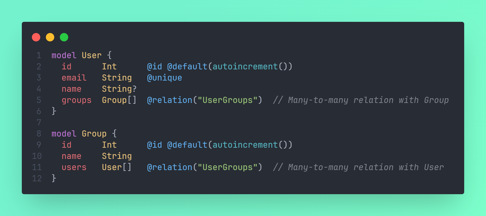

# Quan hệ n - n

## Explicit many-to-many relations

- **Explicit many-to-many relations** trong Prisma yêu cầu phải tạo một bảng trung gian (join table) để quản lý mối quan hệ này, thay vì để Prisma tự động xử lý.
- Ví dụ, giả sử ta có hai bảng: `User` và `Group`. Để tạo một quan hệ many-to-many giữa chúng bằng explicit relations, ta cần thêm một bảng trung gian `UserGroup`.

:::tip

- **Explicit many-to-many relations** thích hợp khi ta cần thêm các thuộc tính bổ sung cho bảng trung gian.

:::

## Implicit many-to-many relations

- Trong Prisma, **implicit many-to-many relations** (quan hệ nhiều-nhiều ngầm định) là cách thiết lập quan hệ nhiều-nhiều tự động mà không cần tạo một bảng trung gian (join table) một cách rõ ràng. Prisma sẽ tự động tạo bảng trung gian trong cơ sở dữ liệu để quản lý mối quan hệ này mà không yêu cầu ta phải định nghĩa bảng đó trong mô hình Prisma của mình.
- Ví dụ, giả sử ta có hai bảng `User` và `Group`, và ta muốn thiết lập quan hệ many-to-many giữa chúng mà không phải khai báo bảng trung gian:

➡️ Prisma sẽ tạo bảng với tên `_usergroups`, chứa hai khóa ngoại: `A (groupId)` và `B (userId)` để quản lý mối quan hệ này

:::note

- Giữa 2 model, model nào có tên theo thứ tự Alphabet nhỏ hơn thì `A` là khóa ngoại của model đó, `B` là khóa ngoại của model còn lại.

:::

:::tip

- **Implicit many-to-many relations** thích hợp khi ta không cần thêm các thuộc tính bổ sung cho bảng trung gian, và chỉ cần thiết lập quan hệ nhiều-nhiều đơn giản giữa hai bảng.

:::
