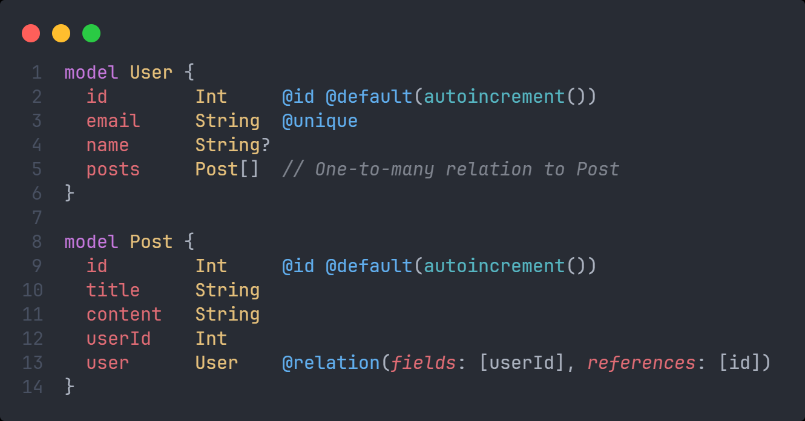
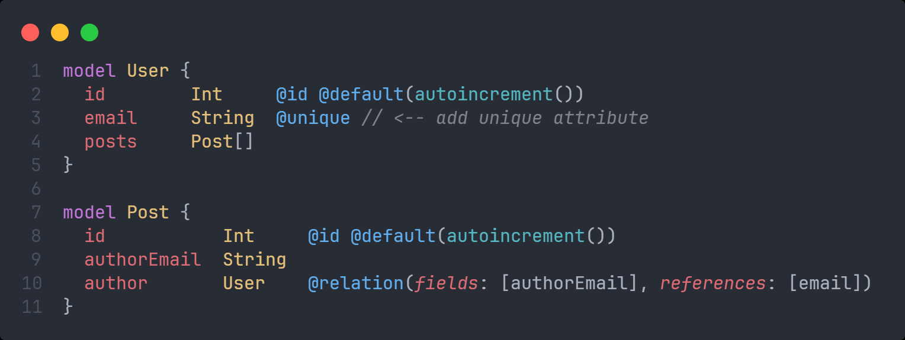
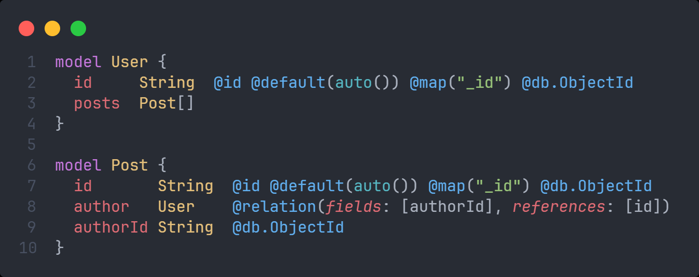
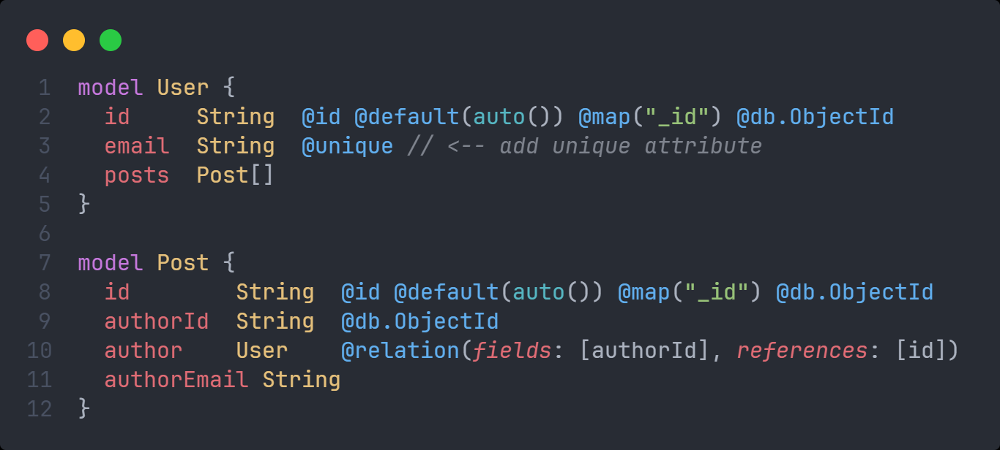
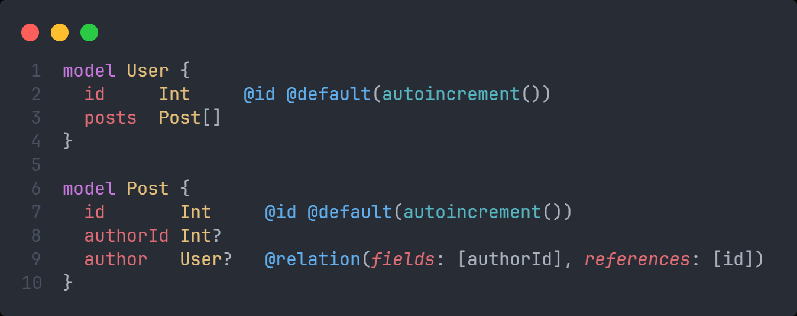
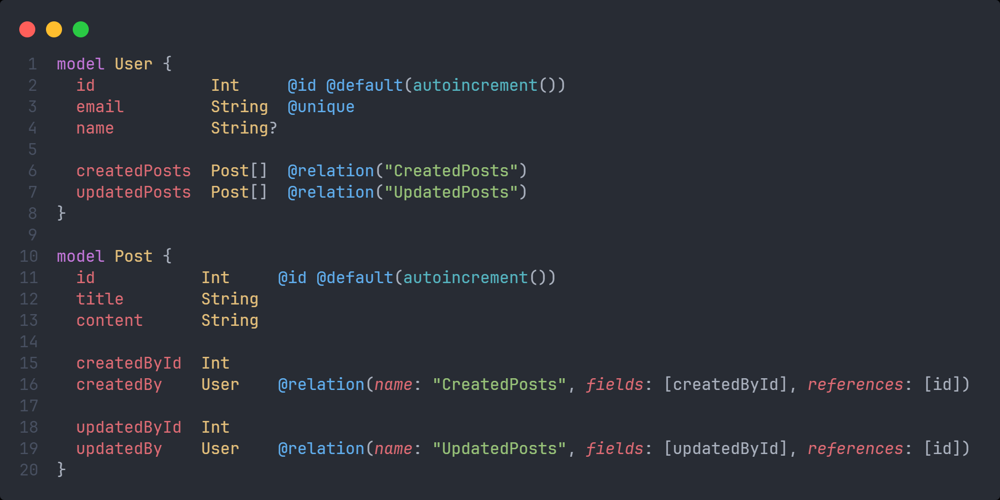

# Quan hệ 1 - n

## 1 - n relation

- Trong Prisma, quan hệ one-to-many (một-nhiều) được sử dụng khi một bản ghi trong một bảng có thể liên kết với nhiều bản ghi trong một bảng khác. Ví dụ, một `User` có thể có nhiều `Post`, nhưng mỗi `Post` chỉ thuộc về một `User`.
- Dưới đây là một ví dụ về quan hệ one-to-many giữa hai bảng `User` và `Post` trong Prisma:

:::info

- Ở bảng `User`, trường `posts` là một danh sách (`Post[]`), biểu thị rằng một `User` có thể có nhiều `Post`.
- Ở bảng `Post`, trường `userId` là khóa ngoại (`foreign key`) liên kết với trường `id` của bảng `User`.
- Thuộc tính `@relation(fields: [userId], references: [id])` thiết lập mối quan hệ với bảng `User`, chỉ ra rằng mỗi `Post` chỉ có một `User`.

Với thiết lập này, một `User` có thể có nhiều bài viết (`Post`), nhưng mỗi bài viết (`Post`) phải luôn liên kết với một `User`.

:::

- Ví dụ sau lấy trường `email` làm khóa ngoại:

:::caution

- Lưu ý rằng trong model được tham chiếu đến, thuộc tính nào mà khóa ngoại liên kết đến thì bắt buộc phải có attribute `@unique` (như ở ví dụ trên là trường `email`)

:::

- Dưới đây là ví dụ trong MongoDB:

## Optional one-to-many relation

- Để khi tạo `Post` mà không cần liên kết với một `User`, ta làm như sau:

## Disambiguating relations

- **Disambiguating relations** trong Prisma là khi ta cần phải làm rõ các mối quan hệ giữa các bảng khi có nhiều hơn một quan hệ giữa hai bảng giống nhau. Điều này tránh nhầm lẫn khi truy cập hoặc sử dụng các mối quan hệ, đặc biệt khi có nhiều quan hệ tương tự giữa các bảng.
- Giả sử ta có một hệ thống mà `User` có thể "tạo" các `Post` và cũng có thể "cập nhật" các `Post`. Trong trường hợp này, có hai quan hệ giữa `User` và `Post`: một là người tạo, một là người cập nhật. Để phân biệt chúng, ta phải đặt tên riêng biệt cho từng mối quan hệ bằng cách sử dụng thuộc tính [name](./@relation#name)
- Dưới đây là ví dụ về cách giải quyết mối quan hệ mơ hồ này:

:::info

- Lý do cần Disambiguating: Nếu không đặt tên rõ ràng cho các quan hệ này (sử dụng `@relation("CreatedPosts")` và `@relation("UpdatedPosts")`), Prisma sẽ không thể phân biệt mối quan hệ nào là của người tạo và mối quan hệ nào là của người cập nhật, gây ra lỗi hoặc nhầm lẫn khi truy cập dữ liệu.

:::

:::tip

- Khi nào cần Disambiguating Relations:
  - Khi có nhiều hơn một quan hệ giữa hai bảng giống nhau.
  - Khi ta muốn quản lý các mối quan hệ khác nhau một cách tường minh để tránh nhầm lẫn trong các truy vấn.
- Disambiguating relations giúp làm rõ các mối quan hệ, đảm bảo chúng được truy vấn và quản lý một cách chính xác.

:::
