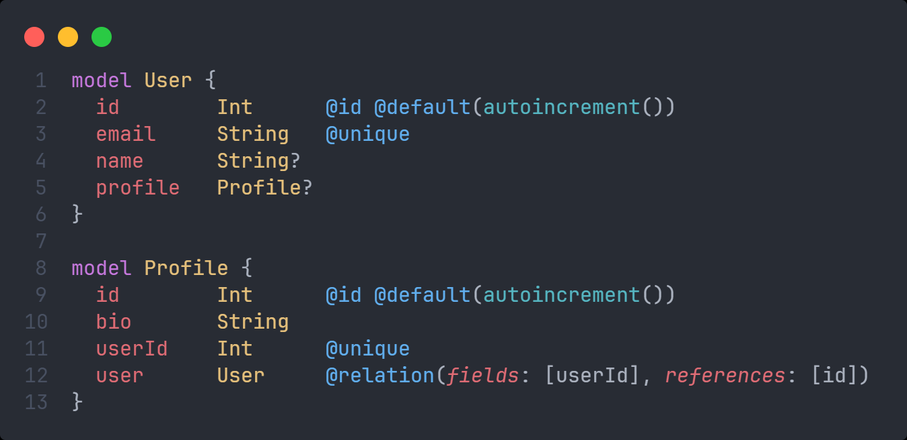
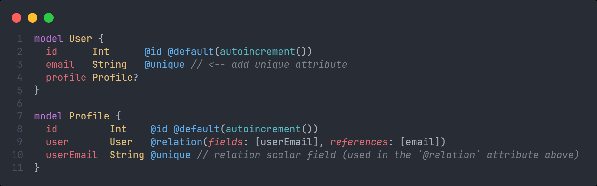
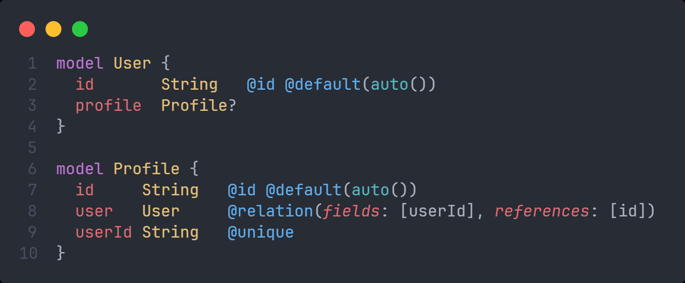
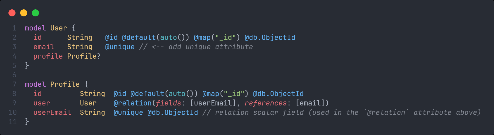
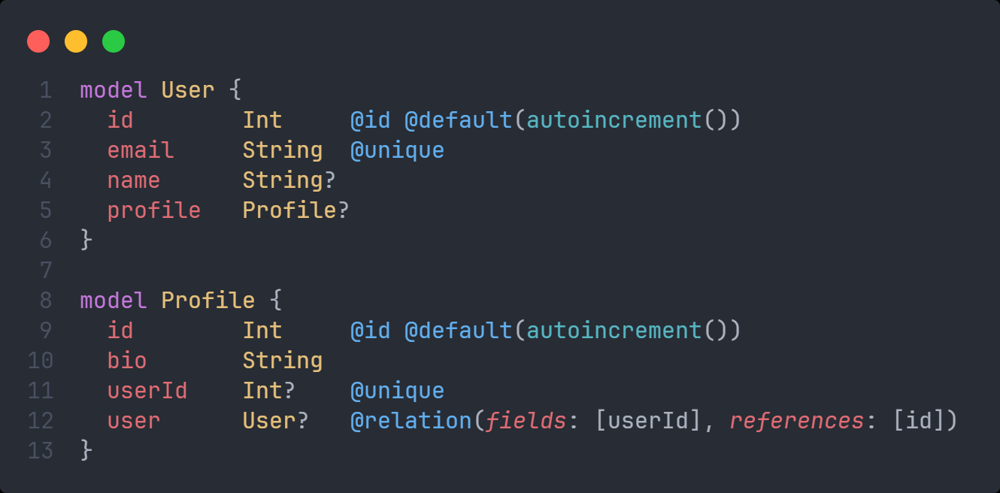

# Quan hệ 1 - 1

## 1-1 relation

- Trong Prisma, quan hệ one-to-one (một-một) được sử dụng khi một bản ghi trong một bảng chỉ có thể liên kết với một bản ghi duy nhất trong bảng khác. Ví dụ, một `User` có thể có một `Profile`, và mỗi `Profile` chỉ thuộc về một `User`.
- Dưới đây là một ví dụ về quan hệ one-to-one giữa hai bảng `User` và `Profile` với CSDL quan hệ trong Prisma:

:::info

- Trong ví dụ trên:
  - `User` có thể có 0 hoặc 1 `Profile` (vì `profile` field là optional)
  - Một `Profile` bắt buộc phải connect với một `User`
  - Trong bảng `Profile`, trường `userId` là một khóa ngoại (`foreign key`) trỏ đến trường `id` của bảng `User`.
  - Thuộc tính `@unique` ở trường `userId` đảm bảo rằng một `User` chỉ có thể có một `Profile` duy nhất. (bắt buộc phải đặt để ràng buộc)

:::

- Ví dụ bên trên lấy `id` của user làm khóa ngoại, ví dụ sau đây sẽ lấy `email` làm khóa ngoại:

:::caution

- Lưu ý rằng trong cả 2 model, thuộc tính làm khóa ngoại và thuộc tính được khóa ngoại liên kết đến thì bắt buộc phải có attribute `@unique` (như ở ví dụ trên là `email` và `userEmail`)

:::

- Dưới đây là ví dụ trong MongoDB:

## Optional 1-1 relation

- Trong ví dụ trên, khi tạo **Profile** thì ta bắt buộc phải liên kết với 1 **User** cụ thể, để không phải làm vậy, ta đánh dấu chỗ `userId` với `user` trong model **Profile** là optional:

